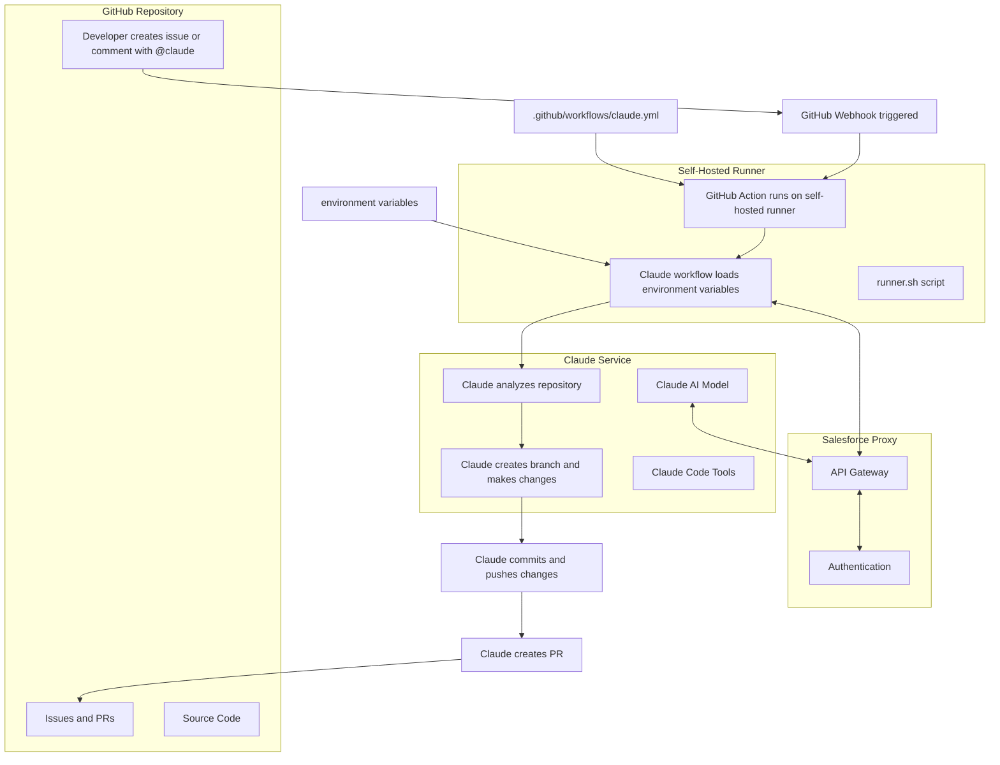

# Claude Bot Workflow Diagram



## Components Explained

### 1. GitHub Repository
- **Issues and Comments**: Where developers tag `@claude` to request help
- **Source Code**: The codebase that Claude analyzes and modifies
- **Workflows**: `.github/workflows/claude.yml` defines how Claude is triggered

### 2. Self-Hosted Runner
- **GitHub Action Runner**: Runs on your local machine
- **Environment Setup**: Configures the Claude API connection details
- **Authentication**: Uses your API key to authenticate with the Claude service

### 3. Salesforce Claude Proxy
- **API Gateway**: `https://eng-ai-model-gateway.sfproxy.devx-preprod.aws-esvc1-useast2.aws.sfdc.cl/chat/completions`
- **Authentication**: Verifies your API key
- **Model Handling**: Maps your request to the appropriate Claude model (`claude-sonnet-4-20250514`)

### 4. Claude Service
- **Claude AI Model**: Processes the request and generates responses/code
- **Code Analysis Tools**: Analyzes your repository structure and code
- **Code Generation**: Creates new code based on the request

## Environment Configuration
Key environment variables that enable Claude to work with the Salesforce proxy:
```yaml
ANTHROPIC_BASE_URL: https://eng-ai-model-gateway.sfproxy.devx-preprod.aws-esvc1-useast2.aws.sfdc.cl/chat/completions
ANTHROPIC_API_BASE: https://eng-ai-model-gateway.sfproxy.devx-preprod.aws-esvc1-useast2.aws.sfdc.cl/chat/completions
ANTHROPIC_MODEL: claude-sonnet-4-20250514
CLAUDE_CODE_USE_DIRECT_COMPLETION_ENDPOINT: "1"
CLAUDE_CODE_SKIP_BEDROCK_AUTH: "1"
CLAUDE_CODE_USE_BEDROCK: "1"
```

## Sequence of Events from Issue to PR

1. **Trigger**: Developer creates an issue or comment containing `@claude`
2. **Detection**: GitHub webhook detects the mention and triggers the GitHub Action
3. **Environment**: Self-hosted runner sets up the environment with proper API endpoints and credentials
4. **Connection**: The action connects to the Salesforce Claude proxy
5. **Analysis**: Claude analyzes the repository and issue/comment to understand the request
6. **Branch**: Claude creates a new branch for changes (format: `claude/issue-{number}-{timestamp}`)
7. **Implementation**: Claude makes code changes based on the request
8. **Commit**: Claude commits the changes with appropriate messages
9. **Push**: The changes are pushed to the new branch
10. **PR Creation**: Claude creates a pull request with detailed descriptions
11. **Response**: Claude updates its comment on the issue with results and PR link